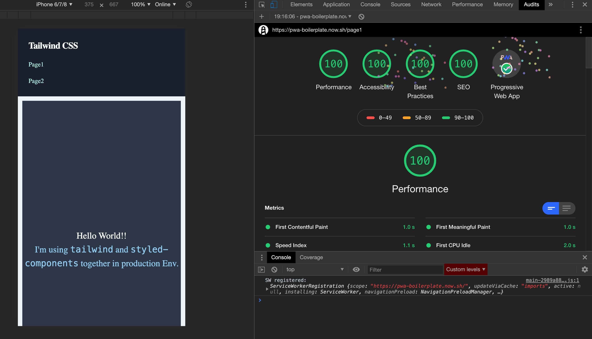

# NextJS boilerplate with Tailwind CSS and Styled-Components

It provides the best of all worlds.
***

Open in incognito mode for audit.
***
## Todo

- [x] Basic Setup
- [x] Tailwind config
- [x] Styled-components config
- [x] Optional post-css config for plain CSS with Tailwind (Root and Page wise)
- [x] PWA setup
- [x] Service-Worker setup
- [x] Workbox
- [x] Axios setup [WIP]
- [x] Redux setup [WIP]
- [ ] SEO
- [x] Critical CSS
- [x] Directory structure setup
- [ ] Webpack optimization
- [x] Routing
- [x] Cookies
- [x] Linting Rules (eslint)
- [x] Formatting Rules (prettier)
- [ ] Theming [WIP]
- [x] Environment Setup [WIP]
- [x] Storybook [Done] / style guidist [Backlog]
- [x] Lighthouse Scores [~100]
- [ ] Docker setup
- [x] Auto-deployment to now.sh - NOW config
- [ ] Others
